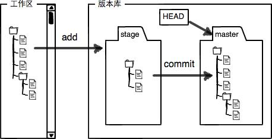

# 工作区
工作区是你能看到的目录(比如这里的learngit文件夹)

# 暂存区
工作区下有一个隐藏的目录`.git`，这个是Git的版本库。

Git的版本库里存了很多东西，其中最重要的就是称为stage（或者叫index）的暂存区，还有Git为我们自动创建的第一个分支master，以及指向master的一个指针叫HEAD。

# git add和git commit命令的区别
git add把修改的文件提交到暂存区，git commit把暂存区内的所有内容提交到当前分支。