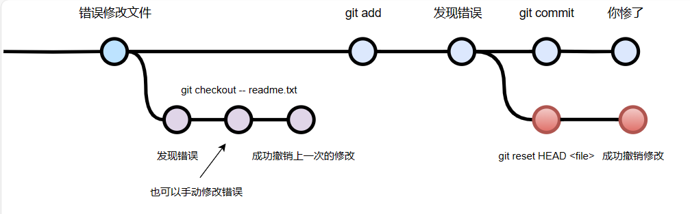

# 两种情况
简单来看就是这个样子

## 在git add之前发现错误
用`git checkout -- file`可以丢弃工作区的修改。
这里有两种情况：

一种是readme.txt自修改后还没有被放到暂存区，现在，撤销修改就回到和版本库一模一样的状态；

一种是readme.txt已经添加到暂存区后，又作了修改，现在，撤销修改就回到添加到暂存区后的状态。

总之，就是让这个文件回到最近一次`git commit`或`git add`时的状态。

## 在`git add`之后，`git commit`之前
用命令`git reset HEAD file`可以把暂存区的修改撤销掉（unstage），重新放回工作区：

之后再使用`git checkout -- file`丢掉工作区的修改。

## git commit之后
使用第5个文件里的版本回退可以找回原来的版本，但是如果你push到了远程版本库，你就真的惨了。