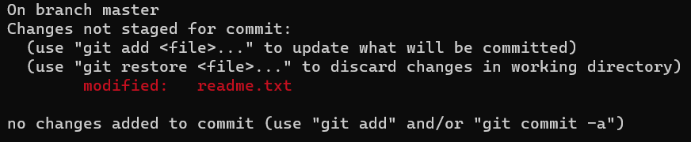
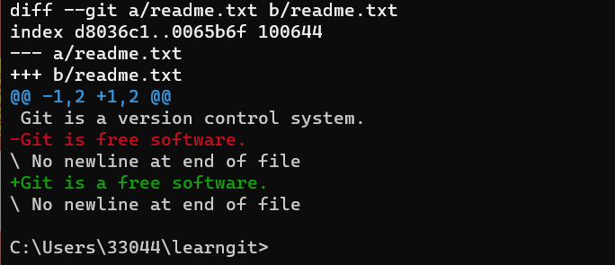
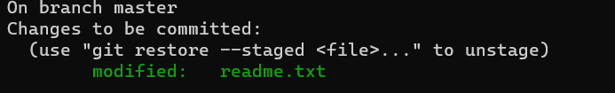
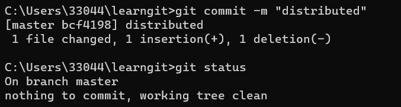

# 修改文件和查看文件状态
## 修改文件
先对之前的readme.txt进行直接修改, 这里修改成了
```
Git is a version control system.
Git is a free software.
```
与之前相比多加上了一个a

## 查看文件的状态
使用`git status`命令 
```
git status
```

这里告诉我们这里进行了修改，但是没有告知修改的内容。

使用`git diff`命令(git diff顾名思义就是查看difference，显示的格式正是Unix通用的diff格式)
```
git diff
```


## 提交文件
在得知文件状态后，就可以放心地把文件放进仓库里了

添加旧有文件和添加新文件同样使用`git add`命令
```
git add readme.txt
```
提交完后，再次使用`git status`查看仓库的状态，会发现红色的readme.txt变成了绿色的readme.txt


再把已经添加的readme.me文件使用`git commit`提交到git的仓库里
```
git commit
```

Git告诉我们当前没有需要提交的修改，而且，工作目录是干净（working tree clean）的。