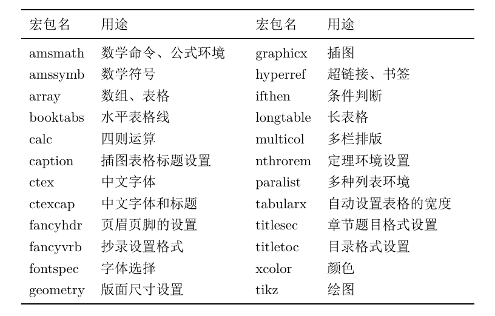

```latex
\usepackage[]{}
```

# 常用宏包


查询宏包文档指令：texdoc tikz

```latex
\begin{tabularx}{\linewidth}{lXlX}
		\toprule
		宏包名&用途&宏包名&用途\\ \midrule
		amsmath&数学命令、公式环境&graphicx&插图\\
		amssymb&数学符号&hyperref&超链接、书签\\
		array&数组、表格&ifthen&条件判断\\
		booktabs&水平表格线&longtable&长表格\\
		calc&四则运算&multicol&多栏排版\\
		caption&插图表格标题设置&nthrorem&定理环境设置\\
		ctex&中文字体&paralist&多种列表环境\\
		ctexcap&中文字体和标题&tabularx&自动设置表格的宽度\\
		fancyhdr&页眉页脚的设置&titlesec&章节题目格式设置\\
		fancyvrb&抄录设置格式&titletoc&目录格式设置\\
		fontspec&字体选择&xcolor&颜色\\
		geometry&版面尺寸设置&tikz&绘图\\ \bottomrule
	\end{tabularx}
```