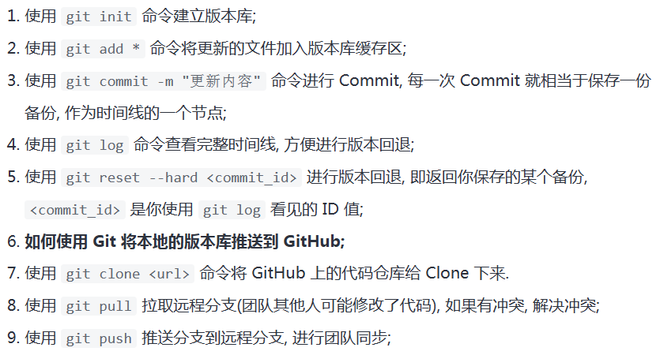

# 学习Git的大纲
声明：本Git笔记基于 [廖雪峰的Git教程](https://www.liaoxuefeng.com/wiki/896043488029600)

Git不是一个需要深入学习的东西，只需要学会基本指令就足以了。

这些所谓的基本指令包括以下这几个：

之后的笔记会根据这个大纲进行编写。

作为一个大一学生，我感觉目前还用不到 `Git`分支的功能，最重要的还是学会怎么通过Git使用远程仓库。
