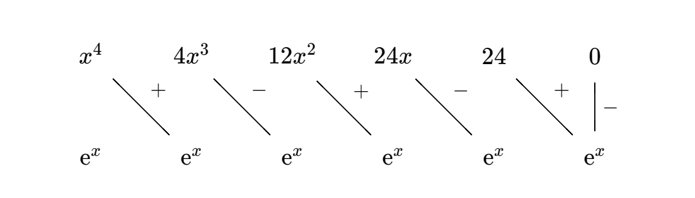

# 分布积分法的推广以及表格的应用
$\displaystyle \int u^{(x)}v\mathrm{d}x=(-1)^{n}\int uv^{(n)}\mathrm{d}x+\sum_{k=1}^{n}(-1)^{k-1}v^{(k-1)}n^{(n-k)}$

上面这个公式没必要记住，记住这个图就行。

举个例子： $\int x^{4}\mathrm{e}^{x}\mathrm{d}x$

带入图中的数据，易知 $\displaystyle \int x^{4}\mathrm{e}^{x}\mathrm{d}x=\left( x^{4}-4x^{3}+12x^{2}-24x+24 \right)\mathrm{e}^{x}-\int 0\times  \mathrm{e}^{x} \mathrm{d}x + C$

给个简单的练习：
$
\displaystyle 
\int \mathrm{e}^{x}\sin x\mathrm{d}x$

